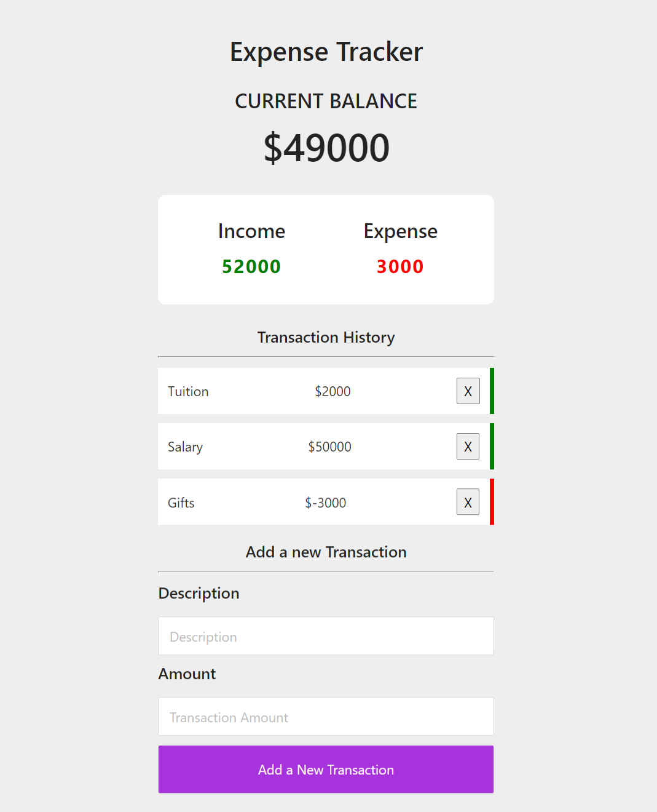

## React Expense Tracker

PanaCloud Bootcamp 2020 Frist Project.
This is a simple web application in which you can keep track of your expenses and income. You can add a new transaction and delete the transaction and see your old transactions. In order to maintain the data you need to use database but in this project database is not connected only local state is used.

## Project Specification

React app using hooks (useState, useContext, useReducer) and the context API.

 <ul>
   <li>Display transaction items</li>
   <li>Show balance, expense and income totals</li>
   <li>Add new transation and reflect in total</li>
   <li>Transaction history</li>
   <li>Persist to local storage</li>
 </ul>

## URL

## Interface

